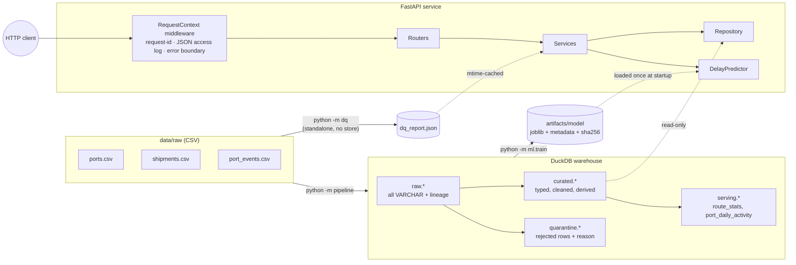
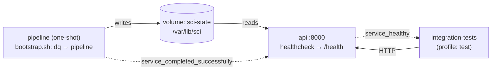

# Supply Chain Intelligence Mini-Platform

A thin, end-to-end slice of a supply-chain intelligence platform. It covers data-quality checks on raw shipping data, a layered DuckDB warehouse, a booking-time delay-risk model, and a production-style REST API over all of it.

**Stack:** Python 3.12 · **FastAPI** + Uvicorn · DuckDB · scikit-learn · pytest · Ruff · Docker / Docker Compose

> **Status.** This drop delivers Part 1.1 (API service), 1.2 (testing) and 1.3 (containerisation) of the brief.
> The DQ module, pipeline and model are built only far enough for every endpoint to work end-to-end on real data. Part 2 and Part 3 deepen them.
> README sections still to come with later parts: CI/CD, Production Support Runbook, full Tech Choices, If I had more time, Scaling to production.

---

## Getting started

### One command (Docker)

```bash
git clone <repo-url> supply-chain-intel && cd supply-chain-intel
docker compose up --build
```

That command builds the image (about 2–3 minutes the first time) and then does three things:

1. It runs a one-shot **`pipeline`** container. That container runs the standalone DQ checks on the raw CSVs, builds the DuckDB warehouse into a named volume, and exits 0.
2. It starts **`api`** only after the pipeline has *completed successfully*. Compose uses `depends_on: condition: service_completed_successfully` for this.
3. It serves the API on <http://localhost:8000>. Interactive docs are at <http://localhost:8000/docs>.

```bash
curl -s localhost:8000/health | jq          # every check should say "ok"
```

Run the end-to-end suite against the real containers:

```bash
make docker-test     # = docker compose --profile test run --rm integration-tests, then tears down
```

### **Working CI**

**Refer to GitHub Actions:**


### Local (no Docker)

```bash
python3.12 -m venv .venv && source .venv/bin/activate
make install         # runtime + dev deps
make run             # DQ checks -> pipeline -> API on :8000
make test            # 141 tests: unit + integration, with coverage
```

The `Makefile` targets are thin wrappers, so every step is also runnable directly:

```bash
python -m dq --input ./data/raw --output ./artifacts/dq_report.json     # or: python dq_check.py --input ./data/raw
python -m pipeline --input ./data/raw --db ./data/warehouse/supply_chain.duckdb
python -m ml.train                                                      # optional: model artefact is committed
python -m app
```

---

## Architecture diagram



### Docker Compose topology



---

## API reference

| Method | Path | Purpose | Notable status codes |
|---|---|---|---|
| `GET` | `/health` | Readiness. Returns service status, version, build SHA, uptime, and DB / model / DQ-report checks. | `200` ready · `503` degraded |
| `GET` | `/health/live` | Liveness: the process is up. | `200` |
| `GET` | `/shipments/{id}` | Full details for one shipment, including port details and the DQ flags applied to that row. | `200` · `404 SHIPMENT_NOT_FOUND` |
| `GET` | `/shipments` | List with filters and pagination. | `200` · `422` |
| `GET` | `/routes/{origin}/{destination}/stats` | Average, median and p90 delay; on-time rate; counts. Optional date range. | `200` · `404 PORT_NOT_FOUND` · `422` |
| `POST` | `/predict-delay` | Delay-risk prediction from booking-time features. | `200` · `404` · `422` · `503` (model not loaded) |
| `GET` | `/data-quality/report` | The JSON written by the standalone DQ module. Filterable. | `200` · `503` (report not generated) |

**`GET /shipments` parameters:**

- `origin` and `destination` take port codes and are case-insensitive.
- `status` is one of `DELIVERED | DELAYED | CANCELLED | UNKNOWN`.
- `cargo_type` filters on the canonical cargo type.
- `date_from` and `date_to` are inclusive `YYYY-MM-DD` bounds on **`planned_departure`**.
- `page` must be ≥ 1. `page_size` defaults to 20 and has a maximum of 100.
- `sort_by` is one of `planned_departure | booking_date | planned_arrival | shipment_id | actual_delay_hours`.
- `order` is `asc` or `desc`.

The response is `{ "items": [...], "pagination": { "page", "page_size", "total_items", "total_pages" } }`.

**`POST /predict-delay`** takes *exactly one* of the following. If you send both or neither, the request is rejected with `422`.

```jsonc
{ "shipment_id": "SHP-00421" }                         // look up an existing booking
{ "booking": {                                         // or score a new one
    "origin_port": "CNSHA", "destination_port": "NLRTM", "cargo_type": "Electronics",
    "container_count": 20, "weight_tons": 950.5,
    "booking_date": "2025-09-01T08:00:00",
    "planned_departure": "2025-09-10T08:00:00",
    "planned_arrival": "2025-10-12T08:00:00" } }
```

The response contains `delay_probability`, `predicted_delayed`, `risk_band` (LOW, MEDIUM or HIGH), `decision_threshold`, `model_version`, and the exact `inputs` that were scored.

### Quick tour

```bash
curl -s localhost:8000/shipments/SHP-00421 | jq
curl -s "localhost:8000/shipments?origin=CNSHA&status=DELAYED&date_from=2025-01-01&date_to=2025-06-30&page_size=5" | jq
curl -s localhost:8000/routes/CNSHA/NLRTM/stats | jq
curl -s -XPOST localhost:8000/predict-delay -H 'content-type: application/json' -d '{"shipment_id":"SHP-00421"}' | jq
curl -s "localhost:8000/data-quality/report?severity=critical&only_failed=true" | jq
curl -s localhost:8000/shipments/SHP-99999 | jq      # structured 404
```

### Error contract

Every non-2xx response has the same shape. This includes framework-level 404s and 405s, validation failures, and unhandled exceptions:

```json
{ "error": { "code": "SHIPMENT_NOT_FOUND", "message": "Shipment 'SHP-99999' was not found",
             "details": { "shipment_id": "SHP-99999" }, "request_id": "9f1c…" } }
```

| HTTP | `code` values | When |
|---|---|---|
| 404 | `SHIPMENT_NOT_FOUND`, `PORT_NOT_FOUND`, `ROUTE_NOT_FOUND` | Unknown resource or unknown path |
| 405 | `METHOD_NOT_ALLOWED` | Wrong verb |
| 422 | `VALIDATION_ERROR` | Schema or type validation (bad enum, malformed port code, bad body) |
| 422 | `INVALID_REQUEST` | Semantically invalid request (inverted date range, origin = destination, page_size over the cap) |
| 503 | `SERVICE_UNAVAILABLE` | A dependency (DB, model, DQ report) isn't loaded |
| 500 | `INTERNAL_ERROR` | Unhandled bug. The stack trace is logged with the request id and never returned to the client. |

### Structured logging

All logs, including Uvicorn's own, are JSON lines on stdout. Every request emits one `http.request` record with `method`, `path`, `route` (the template, which is useful for aggregation), `query`, `status_code`, `latency_ms`, `client_ip` and `request_id`. The `X-Request-ID` header is honoured if the client sends one, otherwise generated, and echoed back in the response. It is also attached to every log line written during that request, including tracebacks.

```json
{"timestamp":"2026-10-08T13:15:13.679+00:00","level":"INFO","logger":"app.access","message":"http.request","service":"supply-chain-intel-api","request_id":"ec273c82…","method":"POST","path":"/predict-delay","route":"/predict-delay","query":null,"status_code":200,"latency_ms":21.1,"client_ip":"172.18.0.1"}
```

---

## Code structure and design patterns

```
app/                         FastAPI service
  main.py                    app factory + lifespan (composition root)
  config.py                  pydantic-settings, env prefix SCI_ (12-factor)
  logging_config.py          JSON formatter + request-id ContextVar
  middleware.py              pure-ASGI request logging / correlation id / error boundary
  errors.py                  domain exception hierarchy -> structured JSON handlers
  dependencies.py            DI providers (resolved from app.state, overridable in tests)
  db.py                      read-only DuckDB, one cursor per unit of work
  api/                       thin routers: HTTP <-> schemas only
  schemas/                   pydantic request/response models (validation lives here)
  services/                  business logic, no HTTP and no SQL
  repositories/              SQL lives here; services depend on a Protocol
dq/                          standalone DQ checks (registry of pure functions) + CLI
pipeline/                    raw -> curated/quarantine -> serving, atomic rebuild
ml/                          shared feature engineering, training, serving-side predictor
shared/                      domain rules used by all of the above (on-time threshold, canonical values)
tests/unit/                  ms-fast tests with fakes; no files, DB or network
tests/integration/           real HTTP against a real running service + pipeline idempotency
```

| Pattern | Where | Why |
|---|---|---|
| **Layered architecture** (router → service → repository) | `app/` | Each layer has one reason to change. Routers know HTTP, services know business rules, repositories know SQL. |
| **Repository + Protocol (ports & adapters)** | `ShipmentRepository`, `Predictor` | Services are tested against in-memory fakes. Swapping DuckDB for Postgres touches one class. |
| **Dependency injection** | `dependencies.py`, `app.dependency_overrides` | No globals or singletons. Tests inject fakes without monkey-patching. |
| **Application factory + lifespan** | `create_app(settings)` | Each test gets an isolated app. Resources are opened once and closed cleanly. |
| **Exception hierarchy → single error mapper** | `errors.py` | Services raise domain errors (`ShipmentNotFoundError`). One place maps them to HTTP. |
| **Registry** | `dq/checks.py` `@register` | Adding a DQ check is one decorated function. The runner, report and API pick it up automatically. |
| **Single source of truth for domain rules** | `shared/reference.py` | The 24-hour on-time rule and the canonical statuses and cargo types are shared by DQ, SQL, ML and API. The pipeline loads them into `ref.*` tables. |
| **Graceful degradation** | lifespan + `/health` | A missing model or DB doesn't crash-loop the pod. `/health` returns 503 naming the broken dependency, and only the affected endpoints return 503. |

### Notable engineering decisions

- **Read-only API, single writer.** The API opens DuckDB with `read_only=True`, so the pipeline is the only writer. The pipeline builds into a temp file and swaps it in atomically with `os.replace`. That makes re-runs idempotent, and a failed run never corrupts the live warehouse.
- **Thread safety.** FastAPI runs sync endpoints in a thread pool. Each request gets its own `connection.cursor()`, which is the DuckDB-documented way to share one database across threads.
- **SQL injection.** All values are bound parameters. The only interpolated identifier, `sort_by`, is validated against a whitelist first, both by the `Literal` type at the edge and again in the repository.
- **Model artefact integrity.** `joblib` is pickle. The predictor checks the artefact's SHA-256 against `model_metadata.json` and refuses to load on a mismatch.
- **No train/serve skew.** `ml.features.build_features` is the *same function* at training and at inference. The repository's `get_booking_inputs` selects only booking-time columns, which forms the leakage boundary. A unit test proves that supplying actuals doesn't change any feature value.

---

## Testing

```bash
make test-unit          # 121 tests, ~2 s, no infrastructure
make test-integration   # 20 tests, ~6 s, real HTTP against a real uvicorn process
make docker-test        # same integration suite, run inside compose against the real containers
make test               # everything + coverage
```

**Unit tests (`tests/unit`)** use in-memory fakes. They need no files, DB or network.

- **Domain:** delay calculation, the on-time boundary (24 h is inclusive), null safety, and canonicalisation of status and cargo type.
- **DQ checks:** each check is tested against a tiny hand-built dataset. Also covered: error isolation for a broken check, percentages, and the report round-trip.
- **ML:** feature derivation, the **leakage guard**, unknown-port handling, the target boundary and risk bands. The committed artefact is checked to load, and a tampered artefact is checked to be rejected.
- **Services:** pagination maths, not-found, the inverted date range rejected *before* the repo is hit, on-time-rate rounding, and model-not-loaded.
- **HTTP contract:** real FastAPI routing, validation and error handlers with fake dependencies. Every status code in the table above is asserted, plus request-id echo and "500 never leaks internals".
- **Logging:** the JSON formatter fields, and the middleware logging method, path, status and latency.

**Integration tests (`tests/integration`)** need a real running service. If `SCI_BASE_URL` is set, they target that URL (for example the compose stack). Otherwise the fixture runs the real DQ checks and pipeline on the raw CSVs into a temp dir, starts `python -m app` as a subprocess on a free port, and waits for `/health` to return 200. Both paths run identical assertions.

- **Shipment lookup:** a successful lookup, with derived fields checked against the raw timestamps; a 404 for an unknown ID; and a 404 for a *quarantined* ID, where the ID is taken from the DQ report's `sample_keys`.
- **Listing:** filters combined with pagination, with no overlap between pages; date-range bounds; and a 422 for a bad enum.
- **Route stats:** `shipment_count` must equal the listing total for the same route, which is a cross-endpoint consistency check. Unknown port returns 404.
- **DQ report:** the report shape, the known issues present, and filtering.
- **Predict-delay:** prediction by ID and by booking, `model_version` matching `/health`, determinism, 404 and 422.
- **Pipeline:** idempotency (build twice and get an identical fingerprint), plus curated-layer invariants: unique keys, no orphan ports, and `on_time_flag` consistent with the delay.

**Flakiness notes.** Nothing depends on wall-clock time, randomness or external services. Model training uses a fixed seed. The only environment-sensitive part is the integration fixture's 60 s start-up timeout, which could be too short on a heavily loaded CI runner. It is a single constant in `tests/integration/conftest.py`.

---

## Containerisation

- **Multi-stage `Dockerfile`.** A `builder` stage creates the venv. The `runtime` stage is slim and has no compilers or pip cache. A `test` stage is the runtime plus dev deps plus tests.
- **Non-root user** (uid 10001). `/var/lib/sci` is pre-created and owned by that user, so a fresh named volume inherits the right permissions.
- **`HEALTHCHECK`** hits `/health` (readiness), so "healthy" in Compose means DB, model and DQ report are all loaded.
- **Self-contained image.** The raw CSVs and the trained model are baked in, so `docker compose up` needs no other files. The warehouse and DQ report are *derived* state and live in the `sci-state` volume.
- **Config through env vars only** (`SCI_*`, see `.env.example`). `BUILD_SHA` is injected as a build arg and surfaced in `/health`.

Useful commands:

```bash
docker compose logs -f api                         # JSON logs
docker compose run --rm pipeline                   # re-run DQ + pipeline (idempotent)
docker compose restart api                         # pick up the rebuilt warehouse
docker compose --profile test down -v              # stop everything and drop the volume
```

---

## Data quality summary (current findings)

The DQ module runs **32 checks** directly on the raw CSVs. 19 of them found issues; the other 13 passed and are kept as regression guards. Full detail, including the rationale for each decision and sample keys, is in `GET /data-quality/report`.

| Check | Severity | Rows (raw %) | Handling |
|---|---|---|---|
| `shipments.exact_duplicate_rows` | critical | 8 (0.16%) | drop |
| `shipments.conflicting_duplicate_ids` | critical | 40 (0.80%) | keep most complete row, quarantine the other |
| `shipments.unknown_port_code` (XXTST / ZZZZZ / UNKNW) | critical | 95 (1.89%) | quarantine |
| `shipments.actual_departure_before_booking` | critical | 39 (0.78%) | null `actual_departure`, keep arrival, flag |
| `shipments.status_non_canonical` (`delivered`, `Complete`, …) | warning | 92 (1.83%) | normalise; status re-derived from actuals |
| `shipments.status_missing_or_placeholder` (blank, `N/A`) | warning | 54 (1.07%) | status → `UNKNOWN`, flag |
| `shipments.status_actuals_mismatch` | warning | 146 (2.90%) | keep, but excluded from metrics and training |
| `shipments.cargo_type_non_canonical` (case / whitespace) | warning | 261 (5.19%) | normalise |
| `shipments.cargo_type_missing` | warning | 15 (0.30%) | `Unknown`, flag |
| `shipments.weight_missing` | warning | 73 (1.45%) | NULL, flag |
| `shipments.weight_non_positive` | warning | 36 (0.72%) | NULL, flag |
| `shipments.container_count_zero` | warning | 23 (0.46%) | NULL, flag |
| `shipments.container_count_outlier` (> 100; bulk of data is 1–50) | warning | 17 (0.34%) | NULL, flag |
| `ports.missing_field` (BEANR country) | warning | 1 (4%) | fill "Belgium" from a documented fix list |
| `port_events.duplicate_event_id` (different content) | warning | 206 (0.82%) | keep both, deterministic surrogate `event_key` |
| `port_events.missing_event_type` | warning | 140 (0.56%) | quarantine |
| `port_events.sentinel_vessel_id` (VSL-0000 / VSL-9999) | warning | 207 (0.83%) | quarantine |
| `port_events.delayed_event_without_delay` | info | 12 (0.05%) | flag |
| `port_events.missing_notes` | info | 1,913 (7.65%) | none (optional field) |

Result: 5,028 raw shipment rows become 4,906 curated rows and 114 quarantined rows. The 8 exact copies are dropped. Port events go from 25,000 raw rows to 24,653 curated and 347 quarantined.

---

## Delay model: honest status

The model is a class-balanced **logistic regression** on booking-time features only: ports, regions and lane, cargo type, containers, weight, booking lead time, planned transit days, port congestion score, and calendar features. It is evaluated on a **temporal** 70/15/15 split by `booking_date`.

On the held-out test slice it scores **ROC-AUC 0.48, precision 0.37, recall 0.41, F1 0.39**. That is *no better than chance*. Univariate profiling agrees: no booking-time field moves the late rate by more than a few points, so the labels look close to random with respect to those fields.

Tuning the threshold for F1 made the model flag every shipment. That gets F1 0.57, which looks better on paper and is useless to an operator, so I fixed the threshold at 0.5 and report the trivial baselines alongside the model in `model_metadata.json`.

The endpoint, artefact handling and leakage boundary are production-shaped. Improving the signal is Part 3 work; for example, rolling port-event congestion features computed strictly before `booking_date`.

---

## Assumptions

- **Timezones.** All timestamps are treated as UTC. The CSVs carry no offsets, and `ports.timezone` describes the port, not the data.
- **Date filters.** The date-range filters on `/shipments` and `/routes/.../stats` apply to `planned_departure`, which is the natural "when did this shipment happen" field.
- **Route-stats denominator.** `on_time_rate` is computed over completed shipments only. Cancelled and unknown-outcome shipments are counted separately and excluded from the denominator.
- **Unknown routes.** Two valid ports with no shipments between them return `200` with zero counts and null metrics. An unknown port code returns `404`. A route with no history is a valid answer; a port that doesn't exist is a client error.
- **Quarantined shipments.** These are not served by `/shipments/{id}`. They are investigation data, not product data.

## Where AI helped

I used Claude as a pair-programmer for scaffolding, test enumeration and README drafting. The key decisions were mine, and I checked each one against the data. That includes the layering and patterns; read-only API with atomic warehouse swap; DQ decisions per issue (e.g. null-out vs drop vs quarantine); the leakage boundary; and the call to report a chance-level model honestly rather than ship a degenerate threshold.
