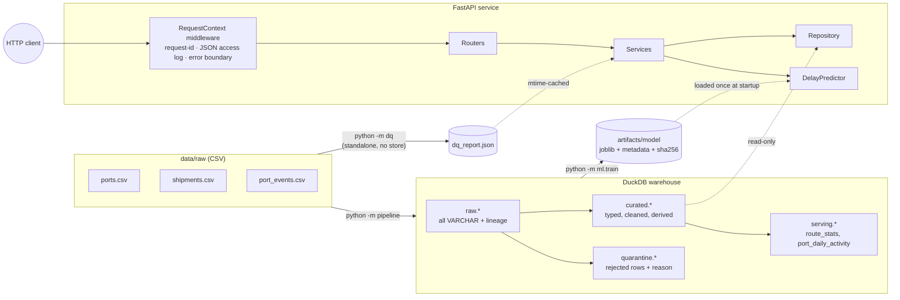
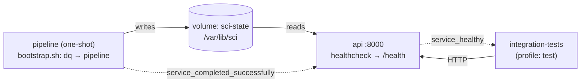
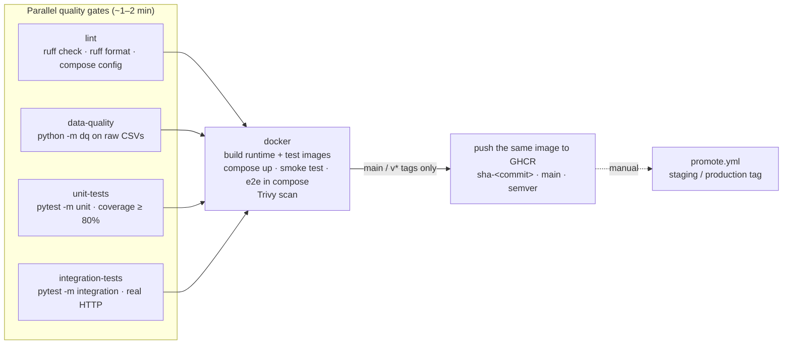
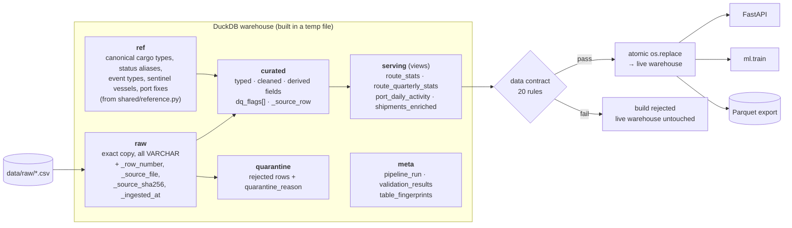
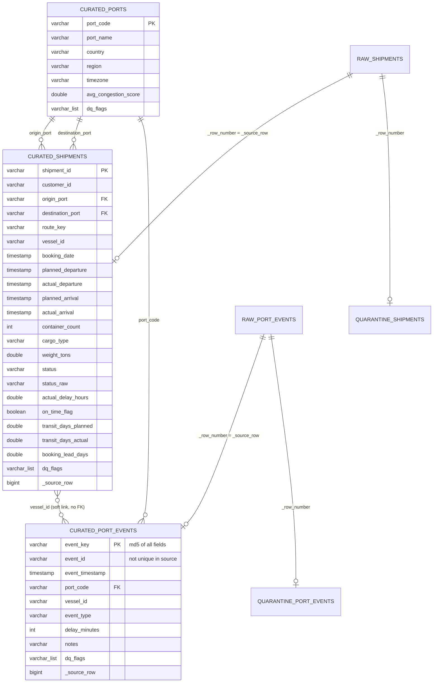

# Supply Chain Intelligence Mini-Platform

[](https://github.com/OWNER/REPO/actions/workflows/ci.yml)

A thin, end-to-end slice of a supply-chain intelligence platform. It covers data-quality checks on raw shipping data, a layered DuckDB warehouse, a booking-time delay-risk model, and a production-style REST API over all of it.

**Stack:** Python 3.12 · **FastAPI** + Uvicorn · DuckDB · scikit-learn · pytest · Ruff · Docker / Docker Compose · GitHub Actions + GHCR

> **Status.** This drop delivers Part 1 (1.1 API service, 1.2 testing, 1.3 containerisation, 1.4 CI/CD Option A, 1.5 runbook) and Part 2 (2.1 standalone data-quality checks, 2.2 tech choices, 2.3 layered, idempotent, contract-validated pipeline) of the brief.
> The delay model is a working baseline; Part 3 deepens it and adds the GenAI assistant.
> README sections still to come with Part 3: If I had more time, Scaling to production.

---

## Getting started

### One command (Docker)

```bash
git clone <repo-url> supply-chain-intel && cd supply-chain-intel
docker compose up --build
```

That command builds the image (about 2–3 minutes the first time) and then does three things:

1. It runs a one-shot **`pipeline`** container. That container runs the standalone DQ checks on the raw CSVs, builds the DuckDB warehouse into a named volume, and exits 0.
2. It starts **`api`** only after the pipeline has *completed successfully*. Compose uses `depends_on: condition: service_completed_successfully` for this.
3. It serves the API on <http://localhost:8000>. Interactive docs are at <http://localhost:8000/docs>.

```bash
curl -s localhost:8000/health | jq          # every check should say "ok"
```

Run the end-to-end suite against the real containers:

```bash
make docker-test     # = docker compose --profile test run --rm integration-tests, then tears down
```

### Local (no Docker)

```bash
python3.12 -m venv .venv && source .venv/bin/activate
make install         # runtime + dev deps
make run             # DQ checks -> pipeline -> API on :8000
make test            # 179 tests: unit + integration, with coverage
```

The `Makefile` targets are thin wrappers, so every step is also runnable directly:

```bash
python -m dq --input ./data/raw --output ./artifacts/dq_report.json     # or: python dq_check.py --input ./data/raw
python -m pipeline --input ./data/raw --db ./data/warehouse/supply_chain.duckdb
python -m ml.train                                                      # optional: model artefact is committed
python -m app
```

---

## Architecture diagram



### Docker Compose topology



---

## API reference

| Method | Path | Purpose | Notable status codes |
|---|---|---|---|
| `GET` | `/health` | Readiness. Returns service status, version, build SHA, uptime, and DB / model / DQ-report checks. | `200` ready · `503` degraded |
| `GET` | `/health/live` | Liveness: the process is up. | `200` |
| `GET` | `/shipments/{id}` | Full details for one shipment, including port details and the DQ flags applied to that row. | `200` · `404 SHIPMENT_NOT_FOUND` |
| `GET` | `/shipments` | List with filters and pagination. | `200` · `422` |
| `GET` | `/routes/{origin}/{destination}/stats` | Average, median and p90 delay; on-time rate; counts. Optional date range. | `200` · `404 PORT_NOT_FOUND` · `422` |
| `POST` | `/predict-delay` | Delay-risk prediction from booking-time features. | `200` · `404` · `422` · `503` (model not loaded) |
| `GET` | `/data-quality/report` | The JSON written by the standalone DQ module. Filterable. | `200` · `503` (report not generated) |

**`GET /shipments` parameters:**

- `origin` and `destination` take port codes and are case-insensitive.
- `status` is one of `DELIVERED | DELAYED | CANCELLED | UNKNOWN`.
- `cargo_type` filters on the canonical cargo type.
- `date_from` and `date_to` are inclusive `YYYY-MM-DD` bounds on **`planned_departure`**.
- `page` must be ≥ 1. `page_size` defaults to 20 and has a maximum of 100.
- `sort_by` is one of `planned_departure | booking_date | planned_arrival | shipment_id | actual_delay_hours`.
- `order` is `asc` or `desc`.

The response is `{ "items": [...], "pagination": { "page", "page_size", "total_items", "total_pages" } }`.

**`POST /predict-delay`** takes *exactly one* of the following. If you send both or neither, the request is rejected with `422`.

```jsonc
{ "shipment_id": "SHP-00421" }                         // look up an existing booking
{ "booking": {                                         // or score a new one
    "origin_port": "CNSHA", "destination_port": "NLRTM", "cargo_type": "Electronics",
    "container_count": 20, "weight_tons": 950.5,
    "booking_date": "2025-09-01T08:00:00",
    "planned_departure": "2025-09-10T08:00:00",
    "planned_arrival": "2025-10-12T08:00:00" } }
```

The response contains `delay_probability`, `predicted_delayed`, `risk_band` (LOW, MEDIUM or HIGH), `decision_threshold`, `model_version`, and the exact `inputs` that were scored.

### Quick tour

```bash
curl -s localhost:8000/shipments/SHP-00421 | jq
curl -s "localhost:8000/shipments?origin=CNSHA&status=DELAYED&date_from=2025-01-01&date_to=2025-06-30&page_size=5" | jq
curl -s localhost:8000/routes/CNSHA/NLRTM/stats | jq
curl -s -XPOST localhost:8000/predict-delay -H 'content-type: application/json' -d '{"shipment_id":"SHP-00421"}' | jq
curl -s "localhost:8000/data-quality/report?severity=critical&only_failed=true" | jq
curl -s localhost:8000/shipments/SHP-99999 | jq      # structured 404
```

### Error contract

Every non-2xx response has the same shape. This includes framework-level 404s and 405s, validation failures, and unhandled exceptions:

```json
{ "error": { "code": "SHIPMENT_NOT_FOUND", "message": "Shipment 'SHP-99999' was not found",
             "details": { "shipment_id": "SHP-99999" }, "request_id": "9f1c…" } }
```

| HTTP | `code` values | When |
|---|---|---|
| 404 | `SHIPMENT_NOT_FOUND`, `PORT_NOT_FOUND`, `ROUTE_NOT_FOUND` | Unknown resource or unknown path |
| 405 | `METHOD_NOT_ALLOWED` | Wrong verb |
| 422 | `VALIDATION_ERROR` | Schema or type validation (bad enum, malformed port code, bad body) |
| 422 | `INVALID_REQUEST` | Semantically invalid request (inverted date range, origin = destination, page_size over the cap) |
| 503 | `SERVICE_UNAVAILABLE` | A dependency (DB, model, DQ report) isn't loaded |
| 500 | `INTERNAL_ERROR` | Unhandled bug. The stack trace is logged with the request id and never returned to the client. |

### Structured logging

All logs, including Uvicorn's own, are JSON lines on stdout. Every request emits one `http.request` record with `method`, `path`, `route` (the template, which is useful for aggregation), `query`, `status_code`, `latency_ms`, `client_ip` and `request_id`. The `X-Request-ID` header is honoured if the client sends one, otherwise generated, and echoed back in the response. It is also attached to every log line written during that request, including tracebacks.

```json
{"timestamp":"2026-10-08T13:15:13.679+00:00","level":"INFO","logger":"app.access","message":"http.request","service":"supply-chain-intel-api","request_id":"ec273c82…","method":"POST","path":"/predict-delay","route":"/predict-delay","query":null,"status_code":200,"latency_ms":21.1,"client_ip":"172.18.0.1"}
```

---

## Code structure and design patterns

```
app/                         FastAPI service
  main.py                    app factory + lifespan (composition root)
  config.py                  pydantic-settings, env prefix SCI_ (12-factor)
  logging_config.py          JSON formatter + request-id ContextVar
  middleware.py              pure-ASGI request logging / correlation id / error boundary
  errors.py                  domain exception hierarchy -> structured JSON handlers
  dependencies.py            DI providers (resolved from app.state, overridable in tests)
  db.py                      read-only DuckDB, one cursor per unit of work
  api/                       thin routers: HTTP <-> schemas only
  schemas/                   pydantic request/response models (validation lives here)
  services/                  business logic, no HTTP and no SQL
  repositories/              SQL lives here; services depend on a Protocol
dq/                          standalone DQ module (no store needed)
  checks.py                  37 registered checks (detection, severity, action, rationale)
  profile.py / gate.py       column profiling · regression gate vs dq/baseline.json
  runner.py / render.py      JSON report · Markdown docs (docs/DATA_QUALITY.md)
pipeline/                    raw -> ref -> curated/quarantine -> serving -> contract -> atomic swap
  sql.py / build.py          layer SQL · orchestration, Parquet export
  validate.py                20-rule post-build data contract
  fingerprint.py             content fingerprint (idempotency proof)
docs/                        generated DQ report, data dictionary
ml/                          shared feature engineering, training, serving-side predictor
shared/                      domain rules used by all of the above (on-time threshold, canonical values)
tests/unit/                  ms-fast tests with fakes; no files, DB or network
tests/integration/           real HTTP against a real running service + pipeline on the real files
```

| Pattern | Where | Why |
|---|---|---|
| **Layered architecture** (router → service → repository) | `app/` | Each layer has one reason to change. Routers know HTTP, services know business rules, repositories know SQL. |
| **Repository + Protocol (ports & adapters)** | `ShipmentRepository`, `Predictor` | Services are tested against in-memory fakes. Swapping DuckDB for Postgres touches one class. |
| **Dependency injection** | `dependencies.py`, `app.dependency_overrides` | No globals or singletons. Tests inject fakes without monkey-patching. |
| **Application factory + lifespan** | `create_app(settings)` | Each test gets an isolated app. Resources are opened once and closed cleanly. |
| **Exception hierarchy → single error mapper** | `errors.py` | Services raise domain errors (`ShipmentNotFoundError`). One place maps them to HTTP. |
| **Registry** | `dq/checks.py` `@register` | Adding a DQ check is one decorated function. The runner, report and API pick it up automatically. |
| **Single source of truth for domain rules** | `shared/reference.py` | The 24-hour on-time rule and the canonical statuses and cargo types are shared by DQ, SQL, ML and API. The pipeline loads them into `ref.*` tables. |
| **Graceful degradation** | lifespan + `/health` | A missing model or DB doesn't crash-loop the pod. `/health` returns 503 naming the broken dependency, and only the affected endpoints return 503. |

### Notable engineering decisions

- **Read-only API, single writer.** The API opens DuckDB with `read_only=True`, so the pipeline is the only writer. The pipeline builds into a temp file and swaps it in atomically with `os.replace`. That makes re-runs idempotent, and a failed run never corrupts the live warehouse.
- **Thread safety.** FastAPI runs sync endpoints in a thread pool. Each request gets its own `connection.cursor()`, which is the DuckDB-documented way to share one database across threads.
- **SQL injection.** All values are bound parameters. The only interpolated identifier, `sort_by`, is validated against a whitelist first, both by the `Literal` type at the edge and again in the repository.
- **Model artefact integrity.** `joblib` is pickle. The predictor checks the artefact's SHA-256 against `model_metadata.json` and refuses to load on a mismatch.
- **No train/serve skew.** `ml.features.build_features` is the *same function* at training and at inference. The repository's `get_booking_inputs` selects only booking-time columns, which forms the leakage boundary. A unit test proves that supplying actuals doesn't change any feature value.

---

## Testing

```bash
make test-unit          # 151 tests, ~6 s, no infrastructure (the pipeline-rule tests use in-process DuckDB)
make test-integration   # 28 tests, ~12 s, real HTTP against a real uvicorn process + pipeline on the real files
make docker-test        # same integration suite, run inside compose against the real containers
make test               # everything + coverage
```

**Unit tests (`tests/unit`)** use in-memory fakes. They need no files, DB or network.

- **Domain:** delay calculation, the on-time boundary (24 h is inclusive), null safety, and canonicalisation of status and cargo type.
- **DQ checks:** each check is tested against a tiny hand-built dataset. Also covered: error isolation for a broken check, percentages, and the report round-trip.
- **ML:** feature derivation, the **leakage guard**, unknown-port handling, the target boundary and risk bands. The committed artefact is checked to load, and a tampered artefact is checked to be rejected.
- **Services:** pagination maths, not-found, the inverted date range rejected *before* the repo is hit, on-time-rate rounding, and model-not-loaded.
- **HTTP contract:** real FastAPI routing, validation and error handlers with fake dependencies. Every status code in the table above is asserted, plus request-id echo and "500 never leaks internals".
- **Logging:** the JSON formatter fields, and the middleware logging method, path, status and latency.

**Integration tests (`tests/integration`)** need a real running service. If `SCI_BASE_URL` is set, they target that URL (for example the compose stack). Otherwise the fixture runs the real DQ checks and pipeline on the raw CSVs into a temp dir, starts `python -m app` as a subprocess on a free port, and waits for `/health` to return 200. Both paths run identical assertions.

- **Shipment lookup:** a successful lookup, with derived fields checked against the raw timestamps; a 404 for an unknown ID; and a 404 for a *quarantined* ID, where the ID is taken from the DQ report's `sample_keys`.
- **Listing:** filters combined with pagination, with no overlap between pages; date-range bounds; and a 422 for a bad enum.
- **Route stats:** `shipment_count` must equal the listing total for the same route, which is a cross-endpoint consistency check. Unknown port returns 404.
- **DQ report:** the report shape, the known issues present, and filtering.
- **Predict-delay:** prediction by ID and by booking, `model_version` matching `/health`, determinism, 404 and 422.
- **Pipeline:** idempotency (build twice and get an identical fingerprint), plus curated-layer invariants: unique keys, no orphan ports, and `on_time_flag` consistent with the delay.

**Flakiness notes.** Nothing depends on wall-clock time, randomness or external services. Model training uses a fixed seed. The only environment-sensitive part is the integration fixture's 60 s start-up timeout, which could be too short on a heavily loaded CI runner. It is a single constant in `tests/integration/conftest.py`.

---

## Containerisation

- **Multi-stage `Dockerfile`.** A `builder` stage creates the venv. The `runtime` stage is slim and has no compilers or pip cache. A `test` stage is the runtime plus dev deps plus tests.
- **Non-root user** (uid 10001). `/var/lib/sci` is pre-created and owned by that user, so a fresh named volume inherits the right permissions.
- **`HEALTHCHECK`** hits `/health` (readiness), so "healthy" in Compose means DB, model and DQ report are all loaded.
- **Self-contained image.** The raw CSVs and the trained model are baked in, so `docker compose up` needs no other files. The warehouse and DQ report are *derived* state and live in the `sci-state` volume.
- **Config through env vars only** (`SCI_*`, see `.env.example`). `BUILD_SHA` is injected as a build arg and surfaced in `/health`.

Useful commands:

```bash
docker compose logs -f api                         # JSON logs
docker compose run --rm pipeline                   # re-run DQ + pipeline (idempotent)
docker compose restart api                         # pick up the rebuilt warehouse
docker compose --profile test down -v              # stop everything and drop the volume
```

---

## CI/CD

The badge at the top of this README reflects the latest run on `main`. Replace `OWNER/REPO` with your GitHub path. On a private repo the badge only renders for people with access.

Everything is implemented with **GitHub Actions** in `.github/workflows/`:

| Workflow | Trigger | Purpose |
|---|---|---|
| `ci.yml` | every PR, push to `main`, `v*.*.*` tags, manual | Quality gates, Docker e2e, publish the tested image to GHCR |
| `data-pipeline.yml` | data or data-code changes, nightly, manual | DQ gate → build, validate and export the warehouse → idempotency proof → data artefacts (see [Running the pipeline on GitHub](#running-the-pipeline-on-github)) |
| `promote.yml` | manual (`workflow_dispatch`) | Deploy or roll back by pointing an environment tag at an already-published image |
| `dependabot.yml` | weekly | Dependency PRs for pip, Docker base image and Actions, each going through the full CI |

### Pipeline stages



| Job | What it does | Fails the build when |
|---|---|---|
| **lint** | `ruff check` (pyflakes, bugbear, bandit-style security rules, isort, pyupgrade) and `ruff format --check`. Also validates `docker-compose.yml`. | Any lint or format violation, or an invalid compose file |
| **data-quality** | Runs the standalone DQ module on the raw CSVs **with the baseline regression gate**. Writes the issue table to the run summary and uploads `dq_report.json` as an artifact. | A check crashes; a passing check starts failing; or a known issue grows by more than 10% vs `dq/baseline.json`. Known, handled issues don't block. |
| **unit-tests** | `pytest -m unit` with coverage. Uploads JUnit and coverage XML. | Any test fails, or coverage drops below **80%** (currently about 87%) |
| **integration-tests** | `pytest -m integration`. The fixture builds the warehouse from the raw CSVs and starts the real API with uvicorn on a free port. | Any e2e assertion fails |
| **docker** | Builds the `runtime` and `test` images with Buildx and the GHA layer cache. Runs `docker compose up`, then a smoke test asserting `/health` is `ok` *and* `build_sha` equals the commit under test. Then runs the e2e suite **inside the compose network** against the real containers, and finally a Trivy CVE scan. Compose logs are always uploaded. | Image build, stack start-up, smoke test or containerised e2e fails |
| **publish** (steps in `docker`) | On `main` and version tags only: re-tags and pushes the **exact image that passed e2e** to `ghcr.io/<owner>/<repo>`. | Registry push fails |

### Quality gates

**Before merge to `main`.** Enable this as a branch protection rule: *Settings → Branches → Require status checks*, and select:

- `Lint & format`
- `Data-quality gate (raw CSVs)`
- `Unit tests`
- `Integration tests (real HTTP, in-process stack)`
- `Docker build + compose e2e (+ publish on main/tags)`

Also require the branch to be up to date, require one review, and disallow force-push.

**Before deploy.**

- Only images that CI has published can be promoted. `promote.yml` verifies that the tag exists in GHCR before moving anything.
- The `production` GitHub Environment should have **required reviewers**, which gives a manual approval gate. Staging needs none.
- In a real deployment, the post-deploy check is the same `/health` smoke test CI runs: `status=ok` and `build_sha` matching. The release is only considered done when that check passes.

### Tooling choices

- **GitHub Actions.** It sits next to the code and has no extra service to run. It has a first-class Docker layer cache (`type=gha`) and native GHCR auth through `GITHUB_TOKEN`, so the workflows need no long-lived secrets.
- **GHCR.** It is free for private repos within your plan quota and uses the same permissions as the repo.
- **Ruff.** One fast tool replaces flake8, isort, pyupgrade, bandit (the `S` rules) and black. Lint takes about a second.
- **Trivy.** It is the de-facto open-source image scanner. It is *informational* here (`exit-code: 0`), because base-image CVEs appear upstream without any change on our side, and a red build we can't fix trains people to ignore red builds. In production it would block on fixable `CRITICAL` findings, with an allow-list file for accepted risks.

### Deployment strategy

The pipeline follows a "build once, promote" model:

1. A PR goes green on all five checks, is reviewed, and is merged.
2. CI runs on `main`. The image that passes e2e is pushed as `sha-<commit>` and `main`. Tagging a release (`git tag v1.2.0 && git push --tags`) also publishes `1.2.0` and `1.2`.
3. *Actions → Promote → Run workflow* with `image_tag=sha-<commit>` and `environment=staging`. This moves the `:staging` tag. The runtime (a VM running compose, ECS, Cloud Run or k8s) pulls `:staging`, either with a restart or with an image-update watcher.
4. Verify `/health` on staging. Then run *Promote* again with `environment=production`; it waits for reviewer approval and then moves `:production`.

The artefact is never rebuilt between test and production, so what ships is exactly the digest that passed e2e. Because the model artefact and raw data are baked into the image, a release is fully reproducible from its tag.

### Rollback

Rollback is the same operation as a deploy. Every promote run writes the *previously deployed* image to its run summary, so the rollback target is always one click away.

```text
Actions → Promote → image_tag = <previous sha-… or version> → environment = production
```

This moves the environment tag back. The runtime pulls the old image and restarts in the time it takes to start a container, with no rebuild and no revert commit. After the rollback, fix forward with a normal PR.

**Data rollback.** The warehouse is derived state, rebuilt atomically by the pipeline container from the CSVs baked into that same image. Rolling back the image therefore also rolls back the data logic.

### Running the gates locally

```bash
make ci           # lint + DQ + unit (coverage gate) + integration — same commands as CI, no Docker
make docker-test  # the compose e2e job
make smoke        # post-deploy smoke test (see Production Support Runbook)
```

### Hardening I would add next

- **Pin third-party actions to commit SHAs.** Dependabot then keeps the pins current.
- **Sign and attest images.** Use `cosign` with keyless OIDC, and produce SLSA provenance and an SBOM with `docker/build-push-action` (`provenance: true`, `sbom: true`).
- **Promote the image across environments by digest, not tag.**
- **Add a scheduled weekly run of the full pipeline.** This catches drift in base images or Actions runners even when no code changes.

---

## Production Support Runbook

Every command here works against the Compose stack in this repo. On another platform, swap `docker compose logs api` for that platform's log viewer: every log line is JSON, so the `jq` filters below carry over unchanged. The `jq` commands assume jq 1.6 or newer.

### Service at a glance

| Component | What it is | Health signal |
|---|---|---|
| `api` | FastAPI on :8000, stateless, read-only access to the warehouse | `GET /health` (readiness: 200 or 503) · `GET /health/live` (liveness) |
| `pipeline` | One-shot job: DQ checks, then warehouse build. It must exit 0 before `api` starts. | Container exit code · `/health → checks.database.detail.run_id / finished_at` |
| Warehouse | `supply_chain.duckdb` in the `sci-state` volume. Rebuilt atomically on every pipeline run. | `/health → checks.database` |
| Model | `artifacts/model/`, baked into the image and SHA-256 verified on load | `/health → checks.model.detail.model_version` |
| DQ report | `dq_report.json` in the `sci-state` volume | `/health → checks.data_quality_report` |

Every request logs one `http.request` line with `request_id`, `method`, `path`, `route`, `status_code` and `latency_ms`. Clients receive the same `request_id` in the `X-Request-ID` header and in every error body. Ask users for it first; it is the fastest way to find their failing request.

### 1. Verifying the service is healthy after a deployment

A deployment counts as done only when all of these pass. Budget about 15 minutes. If any step fails and the cause isn't obvious within that window, **roll back first and debug afterwards** (see section 3).

1. **Confirm the containers are in the expected state.** Run `docker compose ps -a`. `pipeline` should show `Exited (0)` and `api` should show `Up (healthy)`.
2. **Confirm the right build is live and ready.**
   ```bash
   curl -s localhost:8000/health | jq '{status, build_sha, checks: (.checks | map_values(.status))}'
   ```
   You need `status: "ok"`, all three checks `"ok"`, and `build_sha` equal to the commit you released.
3. **Run the smoke test.** It makes 11 checks (12 with `EXPECTED_SHA`) across every endpoint: lookup, list, route stats, prediction, the DQ report, a structured 404, and a latency budget. It exits non-zero if any check fails. Its requests carry `X-Request-ID: smoke-<epoch>`, so they are easy to find in the logs.
   ```bash
   make smoke BASE_URL=https://<host> EXPECTED_SHA=<released commit sha>
   ```
4. **Confirm the data is fresh and complete.** `checks.database.detail.finished_at` should be from this deployment, and the shipment count should be in the expected range (4,906 for the current dataset). A large drop means the DQ or quarantine rules removed more rows than intended. Compare `/data-quality/report` against the previous release.
5. **Watch real traffic for 10–15 minutes.** The 5xx rate should stay below 1%, and p95 latency per route should not regress. The queries are in section 2, under failure mode C.

CI already runs steps 2 and 3 against the freshly built containers. Rerunning them in production checks the parts CI can't see: environment config, volumes and network.

### 2. Most likely failure modes

#### A. The API never comes up because the pipeline job failed

**Symptoms**
- After `docker compose up`, the `api` container is never created or started.
- `docker compose ps -a` shows `pipeline  Exited (1)` or `Exited (2)`.
- There is no `/health` response at all.

This is by design: `api` depends on `pipeline` with `condition: service_completed_successfully`, so bad data never reaches users.

**Diagnose** with `docker compose logs pipeline`:

| Log shows | Cause | Fix |
|---|---|---|
| `Raw input missing: …` or `Expected raw file not found` | A CSV is missing from the image, or was renamed | Restore the file in `data/raw/` and release again, or roll back |
| DQ summary with `checks errored: N`, exit code 2 | A DQ check crashed, typically because a column was renamed or removed upstream | Read the traceback in the log, then fix the check or the schema mapping |
| `DQ GATE FAILED — N regression(s)`, exit code 1 | The new raw data is *worse* than `dq/baseline.json`: a new kind of issue, or a known issue grew by more than 10% | Inspect the listed checks in the report. If the data is wrong, fix it at the source. If the change is expected, run `make dq-baseline` in a reviewed PR. In an emergency, set `SCI_DQ_GATE=off` for one run and record why. |
| `PIPELINE REJECTED — Warehouse failed N data-contract rule(s)`, exit code 1 | The build produced data that breaks a contract rule, for example a reconciliation mismatch or more than 10% quarantined | Read the rule names in the log. The previous warehouse is still live. Reproduce locally with `make pipeline` on the same files. |
| `duckdb … Binder Error / Conversion Error` from `pipeline.build` | Schema drift that the SQL can't handle | Run `python -m dq --input <dir>` locally on the new file to see what changed |
| `No space left on device` | The volume is full. The atomic build needs about twice the warehouse size while the old and new files coexist. | Free space or grow the volume, then `docker compose run --rm pipeline` |

**Why existing data is safe.** The pipeline writes to a temp file and only swaps it in after a successful build. A failed run never corrupts the warehouse; the previous file stays in the volume untouched.

**Related: stale data after a re-ingest.** If you rerun `docker compose run --rm pipeline` while the API is up, the API keeps serving the *old* file until it restarts, because it holds the file handle open. Check `checks.database.detail.run_id` in `/health`. If it doesn't match the latest pipeline run, run `docker compose restart api`.

#### B. `/health` returns 503 with a named component unavailable

**Symptom.** The service is up and liveness passes, but readiness reports `"status": "degraded"`. An orchestrator will stop routing traffic to that instance, but it won't restart-loop it. The `checks` block names the broken component:

```bash
curl -s localhost:8000/health | jq '.checks | to_entries[] | select(.value.status != "ok")'
docker compose logs --no-log-prefix api | jq -R -c 'fromjson? | select(.message | startswith("startup."))'
```

| Unavailable | Startup log | Likely cause | User impact | Fix |
|---|---|---|---|---|
| `model` | `startup.model_unavailable` with `checksum mismatch — refusing to load` | The artefact was modified without updating its metadata | Only `/predict-delay` (503). Everything else works. | Retrain with `make train` and commit both files together, or roll back |
| `model` | `Could not deserialise model` | scikit-learn, numpy or joblib was upgraded without retraining. Dependabot groups these packages for this reason. | Same as above | Pin the old versions back, or retrain in the same PR as the upgrade |
| `database` | `startup.db_unavailable` / `Warehouse not found` | The pipeline didn't run, or the volume was recreated | All data endpoints return 503 | `docker compose run --rm pipeline && docker compose restart api` |
| `data_quality_report` | `Data-quality report has not been generated yet` / `corrupt` | The report is missing, or was hand-edited | Only `/data-quality/report` (503) | `docker compose run --rm pipeline` (it regenerates the report) |

Degraded mode is deliberate. One broken dependency takes down only the endpoints that need it, and the readiness response says exactly which one is broken.

#### C. Spike in 5xx errors or latency

Find the failing requests, then follow one of them end to end using its request id:

```bash
# all 5xx requests
docker compose logs --no-log-prefix api | jq -R -c 'fromjson? | select(.message=="http.request" and .status_code>=500) | {timestamp, request_id, method, path, status_code}'

# full story of one request, including the traceback (logged as `request.unhandled_exception`)
docker compose logs --no-log-prefix api | jq -R -c --arg id "<request_id>" 'fromjson? | select(.request_id==$id)'

# 5xx error rate (%) and p95 latency per route
docker compose logs --no-log-prefix api | jq -R -s '[split("\n")[] | fromjson? | select(.message=="http.request")] | (map(select(.status_code>=500)) | length) / length * 100'
docker compose logs --no-log-prefix api | jq -R -s -c '[split("\n")[] | fromjson? | select(.message=="http.request")] | group_by(.route) | map({route: .[0].route, n: length, p95_ms: (map(.latency_ms) | sort | .[((length-1)*0.95|floor)])})'
```

**Reading the result**

- **5xx with `request.unhandled_exception`.** This is a code bug. It is new if it started with the deployment, so roll back. Clients only ever see `INTERNAL_ERROR` plus the request id; the stack trace stays in the logs.
- **503 `SERVICE_UNAVAILABLE`.** This is failure mode B, not a bug.
- **Latency is high on one route only.** Check the query pattern. Large `page_size` values (capped at 100), deep `page` offsets, or wide date ranges are the usual suspects.
- **Latency is high on every route.** This is resource pressure. Check `docker stats` for CPU and memory throttling. A single instance runs one Uvicorn process. Scale out with more replicas behind a load balancer, which is safe because the API is stateless and read-only.
- **A spike of 4xx after a deployment.** This usually means the API contract changed under existing clients, for example a renamed field or a stricter validator. Compare `/openapi.json` between the two releases.

### 3. Rolling back a bad release

**When.**
- The smoke test fails.
- `/health` stays degraded for more than 5 minutes after a deployment.
- The 5xx rate stays above 1% for more than 5 minutes.

Roll back first and find the root cause afterwards.

**How.** Every release is an immutable image tag (`sha-<commit>`) that already passed CI, so a rollback is just running an older tag. Nothing is rebuilt.

- **Registry-based environments (staging/production).** Go to *Actions → Promote → Run workflow* and set `image_tag` to the previous tag. The last promote run's summary shows that tag under "Previously on …". The runtime pulls the moved `:production` tag and restarts.
- **Single host running Compose.**
  ```bash
  SCI_IMAGE=ghcr.io/<owner>/<repo>:sha-<previous commit> docker compose up -d --no-build
  ```
  Compose reruns the pipeline with the old image's code, data and DQ rules, then recreates `api` on the old image.

**Verify** with `make smoke BASE_URL=… EXPECTED_SHA=<previous commit>`. The `build_sha` check proves the old build is actually serving.

**What a rollback covers.** The image contains the code, the model artefact, the raw CSVs and the DQ rules, and the warehouse is rebuilt from them. Rolling back the image therefore restores *all* of them together, with no separate data or model rollback step. There is no external state to reconcile today, such as migrations or a shared database. Once that exists, migrations must be backward-compatible (expand, then contract) so that the previous release can still run.

**Afterwards.**
1. Write a short incident note covering the timeline and the request ids involved.
2. Fix forward with a normal PR that includes a regression test.
3. Release it through the normal pipeline.

### 4. What I'd add before running this in production

**Monitoring**

- Expose a Prometheus `/metrics` endpoint, for example with `prometheus-fastapi-instrumentator`. It should carry RED metrics (rate, errors, duration) per route, using the route template as the label.
- Add domain metrics:
  - prediction count, with a histogram of `delay_probability`;
  - pipeline duration and row counts per layer;
  - DQ `checks_failed` by severity.
- Add OpenTelemetry tracing, using the existing `request_id` as the correlation key.
- Ship logs centrally to Loki, ELK or CloudWatch. The JSON format needs no parsing rules.

**Alerting**

Base alerts on SLOs, and make every alert link to the relevant section of this runbook.

- *Page:*
  - availability below 99.9% over 30 days;
  - 5xx rate above 1% for 5 minutes;
  - readiness degraded for more than 2 minutes.
- *Ticket:*
  - p95 latency above 300 ms for 15 minutes;
  - pipeline job failure;
  - any DQ `rows_affected` more than twice its baseline, or a new critical check failing. In production this should **block ingestion** rather than only alert.
- *Model:*
  - feature drift, measured with PSI on booking-time features;
  - a shift in the predicted-positive rate;
  - realised precision and recall once actual arrivals land. A sustained drop is the retrain trigger.

**Secrets management**

- There are no secrets today. Part 3 adds an LLM API key, and a real database would add credentials.
- Keep those in a secrets manager such as AWS Secrets Manager, GCP Secret Manager or Vault. Inject them at runtime, never into the image, the Compose file or a committed `.env` file.
- Rotate them on a schedule.
- CI already avoids long-lived secrets: GHCR uses the per-run `GITHUB_TOKEN`.

**Security**

- Add authentication, either API keys or OAuth2 at a gateway.
- Add per-client rate limiting, TLS at the load balancer, and a read-only root filesystem.
- Set container CPU and memory limits.
- Sign images with cosign and verify the signature at deploy time.

**Reliability**

- Run at least two `api` replicas behind a load balancer, using the readiness endpoint for routing.
- Use blue/green or canary releases instead of in-place restarts.
- Schedule the pipeline with an orchestrator such as Airflow or Dagster, and have the API hot-reload the warehouse on a new `run_id` instead of needing a restart.
- Back up the warehouse with object-storage versioning.

**Operability**

- Set up an on-call rotation and a status page.
- Agree a severity scale:

| Severity | Meaning |
|---|---|
| SEV1 | All endpoints down |
| SEV2 | One capability down, for example predictions |
| SEV3 | Degraded latency or stale data |

- Adopt a postmortem template, and add a regression test for every incident.

---

## Data quality summary

The data-quality module in `dq/` is a **standalone step**. It reads the raw CSV files directly and has no dependency on the pipeline, the warehouse or the API. You can therefore check quality *before* anything enters a store.

```bash
python -m dq --input ./data/raw                                        # or: python dq_check.py --input ./data/raw
python -m dq --input ./data/raw --baseline dq/baseline.json            # + regression gate (what CI and the container run)
```

### How it works

- **Raw strings only.** Every file is loaded with `dtype=str` and `keep_default_na=False`, so the checks see exactly what is on disk. Nothing is silently coerced or turned into `NaN`.
- **37 checks** live in `dq/checks.py`. Each one is a small pure function registered with `@register(...)`. Each registration declares:
  - the dataset and key column;
  - a description;
  - **how the issue was detected**;
  - severity;
  - action;
  - rationale.

  The runner executes all of them. If one check crashes, it is reported as `error` and the rest still run.
- **Column profiling** lives in `dq/profile.py`. For every column it records the blank count and percentage, distinct count, inferred type, min, median and max, and the top values. This is the evidence the checks were built from, and it is published in the report's `profile` section.
- **Machine-readable report.** The output is `artifacts/dq_report.json`, written atomically. The same file is served by `GET /data-quality/report`, which accepts `?severity=`, `?dataset=` and `?only_failed=true`. Every check entry contains: `check_name`, `dataset`, `description`, `detection`, `status`, `severity`, `rows_affected`, `total_rows`, `pct_affected`, `action`, `rationale`, `sample_keys`, `error`. The report also records the SHA-256 of each input file.
- **Severity scale.**
  - **critical**: would corrupt metrics or the model if left in.
  - **warning**: degrades quality, and is fixed or flagged in curation.
  - **info**: worth knowing; no change is made.

  Actions are `drop`, `fix`, `flag`, `quarantine` or `none`.
- **Regression gate** (`dq/gate.py` with the committed `dq/baseline.json`). The raw data has *known* issues that the pipeline handles, so "fail on any critical issue" would be permanently red. The gate fails instead when:
  - a check that used to pass now fails;
  - a known issue grows by more than 10%, which is configurable with `--tolerance`;
  - a check crashes.

  `--fail-on-critical` gives a strict mode. After a reviewed data change, run `make dq-baseline`.
- **Human-readable documentation.** [`docs/DATA_QUALITY.md`](docs/DATA_QUALITY.md) is *generated* from the report with `make dq-docs`. It lists, for every issue, how it was detected, its scale, the decision and the reasoning, so it cannot drift from what the checks actually found.

### Findings

The module runs 37 checks. 21 found issues; the other 16 pass and stay as regression guards.

| # | Check | Severity | Rows (raw %) | Decision |
|---:|---|---|---:|---|
| 1 | `shipments.exact_duplicate_rows` | critical | 8 (0.16%) | **drop**: keep the first copy |
| 2 | `shipments.conflicting_duplicate_ids` (same id, different values) | critical | 40 (0.80%) | **quarantine**: keep the most complete version, quarantine the other |
| 3 | `shipments.unknown_port_code` (XXTST / ZZZZZ / UNKNW) | critical | 95 (1.89%) | **quarantine** |
| 4 | `shipments.actual_departure_before_booking` (up to 16 days before booking) | critical | 39 (0.78%) | **fix**: NULL `actual_departure`, keep `actual_arrival`, flag |
| 5 | `shipments.status_non_canonical` (`delivered`, `Complete`, `COMPLETED`) | warning | 92 (1.83%) | **fix**: alias map; status re-derived from timestamps |
| 6 | `shipments.status_missing_or_placeholder` (blank, `N/A`) | warning | 54 (1.07%) | **fix**: `UNKNOWN` unless derivable |
| 7 | `shipments.status_actuals_mismatch` ("completed" but never arrived) | warning | 146 (2.90%) | **flag**: kept for lookup, excluded from metrics and training |
| 8 | `shipments.cargo_type_non_canonical` (case / whitespace; 18 spellings of 10 categories) | warning | 261 (5.19%) | **fix**: normalise |
| 9 | `shipments.cargo_type_missing` | warning | 15 (0.30%) | **flag**: `Unknown` |
| 10 | `shipments.weight_missing` | warning | 73 (1.45%) | **flag**: NULL; the model imputes |
| 11 | `shipments.weight_non_positive` (min −197.87) | warning | 36 (0.72%) | **fix**: NULL and flag (taking `abs()` would be a guess) |
| 12 | `shipments.container_count_zero` | warning | 23 (0.46%) | **fix**: NULL and flag |
| 13 | `shipments.container_count_outlier` (500–996, nothing between 60 and 500) | warning | 17 (0.34%) | **fix**: NULL and flag |
| 14 | `ports.missing_field` (BEANR country blank) | warning | 1 (4%) | **fix**: "Belgium" from a documented fix list |
| 15 | `port_events.duplicate_event_id` (same id, different event) | warning | 206 (0.82%) | **fix**: keep both, deterministic surrogate `event_key` |
| 16 | `port_events.missing_event_type` | warning | 140 (0.56%) | **quarantine** |
| 17 | `port_events.sentinel_vessel_id` (VSL-0000 / VSL-9999, never in shipments) | warning | 207 (0.83%) | **quarantine** |
| 18 | `shipments.planned_transit_outlier_for_route` (same lane: 3 to 35 days) | info | 341 (6.78%) | **none**: explains the weak ML signal |
| 19 | `port_events.delayed_event_without_delay` | info | 12 (0.05%) | **flag** |
| 20 | `port_events.notes_contradict_delay` ("Normal operations" but delayed) | info | 671 (2.68%) | **none**: notes are not used as a feature |
| 21 | `port_events.missing_notes` | info | 1,913 (7.65%) | **none**: optional field |

The 16 checks that currently pass are kept as regression guards:

- *shipments:* ID formats, origin = destination, unparseable timestamps, missing planned dates, impossible planned sequence, arrival before departure, and status label vs delay contradiction.
- *ports:* duplicate code, congestion score outside 0–1, and timezone format.
- *port_events:* exact replays, invalid event type, unknown port, bad timestamp, out-of-order feed, and delay out of range.

---

## Data pipeline and data model

### Layers



| Layer | Purpose | Rules |
|---|---|---|
| `raw` | An auditable, byte-faithful copy of each file | No typing or cleaning. Lineage columns let any curated row be traced to its file and line. |
| `ref` | Reference values the SQL joins against | Generated from `shared/reference.py`, so Python (DQ, ML, API) and SQL share one source of truth |
| `curated` | Clean, typed, trusted entities | One row per entity. Fixes are recorded in `dq_flags`; nothing is changed silently. |
| `quarantine` | Rows that can't be trusted, kept for investigation or replay | Same columns as the stage, plus `quarantine_reason` |
| `serving` | Consumer-shaped views for the API, the GenAI tools and BI | Views only, never a second copy of the logic |
| `meta` | Run metadata, contract results and content fingerprints | Read by `/health` and the CI summary |

### Derived fields (curated layer)

| Field | Definition |
|---|---|
| `actual_delay_hours` | `(actual_arrival − planned_arrival)` in hours. NULL when there is no actual arrival (null-safe). |
| `on_time_flag` | `actual_delay_hours ≤ 24`. NULL, not false, when the outcome is unknown. |
| `route_key` | `origin_port || ' → ' || destination_port` |
| `transit_days_planned` | `(planned_arrival − planned_departure)` in days |
| `transit_days_actual` | `(actual_arrival − actual_departure)` in days. NULL if either is missing or was discarded. |
| `booking_lead_days` | `(planned_departure − booking_date)` in days, a booking-time ML feature |
| `status` | *Re-derived*: `CANCELLED` if cancelled with no arrival; `DELAYED` or `DELIVERED` from the 24h rule if arrived; otherwise `UNKNOWN`. The original label is kept in `status_raw`. |

### Idempotency

1. Every run rebuilds the whole warehouse from `raw` into a **temporary file**.
2. The data contract runs on that file.
3. Only if the contract passes is the file swapped in with an **atomic `os.replace`**.

As a result, running the pipeline twice cannot duplicate or corrupt data. A crash or a rejected build leaves the previous warehouse serving. Every statement is `CREATE OR REPLACE` with deterministic ordering, and the run records a **content fingerprint** (an md5 per table, combined into one SHA-256) in `meta.pipeline_run`. Identical input always gives an identical fingerprint. Three things prove this: `make pipeline-check`, the integration test, and a dedicated step in the GitHub workflow.

Full rebuilds take about 1.7 s for this data. Incremental loads are discussed under Tech choices.

### Data contract (post-build validation)

`pipeline/validate.py` runs 20 SQL rules. Each returns the number of violating rows, and any non-zero result rejects the build (exit 1).

| Category | Rules |
|---|---|
| Keys | Unique, not-null primary keys for shipments, ports and events (`event_key`) |
| Referential integrity | Shipment origin and destination ports, and event ports, exist in `curated.ports` |
| Completeness | Planned timestamps, route, status and cargo are never NULL. Ports are complete. |
| Domains | Status and cargo type are canonical; container count is 1–100; weight is > 0 |
| Derived-field correctness | Delay, on-time flag, route key and transit days are recomputed and compared; status agrees with the delay |
| Reconciliation | raw = exact duplicates + curated + quarantine, for both shipments and events. No row is silently lost or invented. |
| Guards | Quarantine ≤ 10% of raw, so a bad rule can't quietly reject half the data. `curated.shipments` is not empty. |

Results are stored in `meta.validation_results`.

### Data model



| Relation | Grain | Key | Relates to | Main consumers |
|---|---|---|---|---|
| `curated.ports` | one port | `port_code` | parent of shipments (×2) and events | API joins, ML features |
| `curated.shipments` | one shipment | `shipment_id` | → ports via `origin_port` and `destination_port`; → `raw.shipments._row_number` via `_source_row` | API, ML training |
| `curated.port_events` | one event | `event_key` (surrogate) | → ports via `port_code`; vessel-level link to shipments via `vessel_id` | port-level metrics, Part 3 features |
| `quarantine.shipments` / `quarantine.port_events` | one rejected row | raw `_row_number` | → `raw.*` | investigation, replay |
| `serving.route_stats` | one route (all time) | (`origin_port`, `destination_port`) | aggregates `curated.shipments` | route dashboards, GenAI tool |
| `serving.route_quarterly_stats` | route × quarter | (`origin_port`, `destination_port`, `period`) | aggregates `curated.shipments` | "highest average delay this quarter" |
| `serving.port_daily_activity` | port × day | (`port_code`, `event_date`) | aggregates `curated.port_events` | congestion trends |
| `serving.shipments_enriched` | one shipment | `shipment_id` | shipments ⋈ ports (origin and destination) | BI, Parquet consumers |
| `meta.pipeline_run` / `meta.validation_results` / `meta.table_fingerprints` | one run / one rule / one relation | – | – | `/health`, CI summary |

`vessel_id` is a soft link. One vessel carries many shipments and emits many events, and there is no voyage id to join on, so the model has no foreign key between shipments and events. Column-level definitions for every relation are in [`docs/DATA_MODEL.md`](docs/DATA_MODEL.md).

### Running the pipeline locally

```bash
# 1. Environment
python3.12 -m venv .venv && source .venv/bin/activate
pip install -r requirements-dev.txt

# 2. Quality gate on the raw files (nothing is ingested yet)
make dq                       # python -m dq --input data/raw --output artifacts/dq_report.json --baseline dq/baseline.json

# 3. Build the warehouse: raw -> curated/quarantine -> serving -> contract -> atomic swap
make pipeline                 # python -m pipeline --input data/raw --db data/warehouse/supply_chain.duckdb

# 4. Prove it is idempotent (builds twice, compares fingerprints)
make pipeline-check

# 5. Optional: Parquet export of curated / quarantine / serving
make export                   # -> data/export/*.parquet

# 6. Inspect
python scripts/pipeline_summary.py               # layer counts, contract results, quarantine reasons
python -c "import duckdb; print(duckdb.connect('data/warehouse/supply_chain.duckdb', read_only=True).sql(
  'SELECT route_key, period, avg_delay_hours FROM serving.route_quarterly_stats ORDER BY avg_delay_hours DESC LIMIT 5'))"

# 7. Serve it
make run                      # API on :8000 reads the warehouse read-only

# 8. Tests for the data layer
pytest tests/unit/test_dq_checks.py tests/unit/test_pipeline_rules.py tests/integration/test_pipeline.py
```

**After changing raw data or rules:**

1. Run `make dq`. If the gate fails, that is the point: review the regression.
2. If the change is intended, accept it with `make dq-baseline` and `make dq-docs`.
3. Commit `dq/baseline.json` and `docs/DATA_QUALITY.md` in the same PR, so the reviewer sees exactly what changed.

**With Docker:** `docker compose up --build` runs the same gate and pipeline in the one-shot `pipeline` container (`scripts/bootstrap.sh`). You can bypass the gate with `SCI_DQ_GATE=off`. Re-run the pipeline alone with `docker compose run --rm pipeline && docker compose restart api`.

### Running the pipeline on GitHub

`.github/workflows/data-pipeline.yml` runs the same stages as gated jobs:

| Job | What it does | Fails when |
|---|---|---|
| **1 · Data-quality gate** | `python -m dq` on the raw CSVs against `dq/baseline.json`. The issue table goes to the run summary; the report is uploaded. | A regression vs the baseline, a crashed check, or (with `strict`) any critical issue |
| **2 · Build warehouse** | Builds, validates and exports Parquet, then **runs the build a second time and compares fingerprints**. The layer counts, contract results, quarantine reasons and applied fixes go to the run summary. It uploads `supply_chain.duckdb`, `pipeline_run.json` and the Parquet files as the artefact `warehouse-<run>`. | Any contract rule fails, or the two fingerprints differ |

**Triggers:**

- a push to `main` that touches `data/raw/**`, `dq/**`, `pipeline/**`, `shared/**` or `requirements.txt`;
- the same paths on pull requests;
- **nightly at 03:00 UTC**;
- **manually** via *Actions → Data pipeline → Run workflow*, with optional `dq_tolerance` and `strict` inputs.

**To set it up on GitHub:**

1. Push the repo, including `.github/workflows/data-pipeline.yml` and `dq/baseline.json`. Nothing else is needed: no secrets, and no services beyond the runner.
2. Open *Actions* and enable workflows if GitHub asks. The first push to `main` triggers it.
3. Run it once by hand: *Actions → Data pipeline → Run workflow → main*. The run summary shows the DQ table and the pipeline report.
4. Download the data products from the run page under *Artifacts → warehouse-N*.
5. Optionally, add `1 · Data-quality gate` and `2 · Build warehouse` as **required status checks** on `main`. A PR that breaks data quality or the contract then can't merge.
6. The schedule runs only on the default branch. GitHub pauses scheduled workflows after 60 days without repository activity, and a manual run re-enables it.

In production the same jobs would run on the orchestrator's schedule when the upstream feed lands. The `build` job would write to object storage rather than workflow artefacts.

---

## Tech choices

### Data store: DuckDB

**Why DuckDB.**

- **It fits the workload.** The workload is analytical: aggregates by route, by quarter and by port over about 30k rows. Writes are single-writer batches; reads are many. DuckDB is a columnar, vectorised SQL engine built for exactly that.
- **It is embedded, with zero operations.** It is a library plus one file, with no server to run, secure or wait for. That keeps "git clone → running in under 10 minutes" realistic, and the tests use the real engine rather than a mock.
- **It reads the formats we have natively.** CSV and Parquet in, Parquet out, so the raw, curated and export layers need no glue code.
- **Atomic, file-level builds.** A file-level build plus `os.replace` makes idempotency simple and makes rollbacks trivial. Read-only mode also guarantees that the API can't mutate data.

**Alternatives considered.**

- **SQLite:** a row store with loose typing and weak analytical SQL.
- **PostgreSQL:** the right choice for concurrent writers and many API replicas, but an extra service and real operational work for 5,000 rows.
- **Parquet files alone:** no constraints, transactions or SQL surface for the API. I export to Parquet instead.
- **pandas in memory:** not queryable by other processes, and the logic would end up in Python rather than SQL.

### What changes at 100× the data volume

At 100× there are about 500k shipments, about 2.5M events and roughly 0.5 GB of CSV. Honestly, *volume* alone would not force a change: DuckDB processes that on a laptop in seconds. What changes at that scale is the **access pattern and operating model**:

| Concern | Today | At 100× (and running continuously) |
|---|---|---|
| Transform engine | DuckDB, full rebuild in about 1.7 s | **Keep DuckDB** (or Polars) for transforms, reading partitioned **Parquet on object storage** (S3/GCS) |
| Load strategy | Full rebuild + atomic swap | **Incremental**: shipments `MERGE` on `shipment_id` partitioned by booking month; events append-only, partitioned by date, with a watermark for late arrivals. Keep a periodic full rebuild as the correctness backstop. |
| Serving store | DuckDB file, read-only | **PostgreSQL** (managed). A single DuckDB file can't be shared by N API replicas on different hosts, or updated while they read it. Postgres gives indexed point lookups (`/shipments/{id}`) and concurrent reads; the serving views become materialised tables refreshed by the pipeline. |
| Event feed | CSV file | **Kafka / Kinesis**, landing as micro-batches in the lake; DQ checks run per batch |
| Orchestration | CLI + GitHub Actions schedule | **Dagster / Airflow**, with retries, backfills, lineage and SLAs |
| DQ | Custom pandas checks | The same checks expressed in SQL, so they run in the engine rather than in memory. They could become Soda or Great Expectations if a non-engineering team needs to own the rules. |

At 10,000× and beyond, I would move transforms to a cloud warehouse (BigQuery, Snowflake or Databricks) with dbt, while keeping the same raw → curated → serving contract.

### Other choices

| Area | Choice | Rationale |
|---|---|---|
| API | **FastAPI** + Uvicorn | Typed request and response models, automatic OpenAPI docs, and dependency injection out of the box |
| Validation | **Pydantic v2** | One schema serves validation, serialisation and documentation |
| DQ engine | **pandas** over raw strings | Row-level boolean masks are readable and unit-testable, and it is independent of the warehouse by design |
| Transform | **DuckDB SQL** | Set-based, declarative and fast. The same SQL would port to Postgres or a warehouse. |
| ML | **scikit-learn** (logistic regression) | A well-evaluated simple model beats an opaque one. The artefact is a joblib file with a SHA-256 check. |
| LLM (Part 3) | **Anthropic Claude** via native tool use (planned) | First-class tool calling, which the assistant needs. The model and cost per query will be documented in Part 3. |
| Tests | **pytest** + **httpx** | Fixtures make the "real service over HTTP" integration tests simple |
| Lint and format | **Ruff** | Replaces flake8, isort, black and bandit with one fast tool |
| CI/CD | **GitHub Actions** + **GHCR** | Sits next to the code, needs no long-lived secrets, and has a built-in layer cache |
| Packaging | **Docker** multi-stage + **Compose** | Brings the whole stack up with one command and the same image everywhere |

### What I deliberately did not do

- **No orchestrator** (Airflow or Dagster). One idempotent CLI plus a cron-style GitHub schedule covers a single daily batch. An orchestrator would add a service, a scheduler and a metadata database.
- **No dbt.** There are six SQL statements; dbt's toolchain would outweigh them. The layering and the contract tests mirror dbt's models and tests, so migrating later would be mechanical.
- **No Great Expectations or Soda.** About 450 lines of plain, registered Python checks are more transparent, run in milliseconds, and need no configuration language.
- **No streaming stack** (Kafka). The event feed arrives as a file, so I treat it as a micro-batch and keep the streaming concerns explicit: replays, ID collisions, ordering and late data.
- **No incremental loads.** A 1.7 s full rebuild is simpler and idempotent by construction. Incremental loads earn their complexity at much larger volumes.
- **No history tables** (SCD2) and **no timezone conversion.** The data has no change history, and timestamps carry no offsets, so I assumed UTC.
- **No Kubernetes, Terraform or UI**, per the brief. **No authentication**; it is listed in the runbook as a production prerequisite.

---

## Delay model: honest status

The model is a class-balanced **logistic regression** on booking-time features only: ports, regions and lane, cargo type, containers, weight, booking lead time, planned transit days, port congestion score, and calendar features. It is evaluated on a **temporal** 70/15/15 split by `booking_date`.

On the held-out test slice it scores **ROC-AUC 0.48, precision 0.37, recall 0.41, F1 0.39**. That is *no better than chance*. Univariate profiling agrees: no booking-time field moves the late rate by more than a few points, so the labels look close to random with respect to those fields.

Tuning the threshold for F1 made the model flag every shipment. That gets F1 0.57, which looks better on paper and is useless to an operator, so I fixed the threshold at 0.5 and report the trivial baselines alongside the model in `model_metadata.json`.

The endpoint, artefact handling and leakage boundary are production-shaped. Improving the signal is Part 3 work; for example, rolling port-event congestion features computed strictly before `booking_date`.

---

## Assumptions

- **Timezones.** All timestamps are treated as UTC. The CSVs carry no offsets, and `ports.timezone` describes the port, not the data.
- **Date filters.** The date-range filters on `/shipments` and `/routes/.../stats` apply to `planned_departure`, which is the natural "when did this shipment happen" field.
- **Route-stats denominator.** `on_time_rate` is computed over completed shipments only. Cancelled and unknown-outcome shipments are counted separately and excluded from the denominator.
- **Unknown routes.** Two valid ports with no shipments between them return `200` with zero counts and null metrics. An unknown port code returns `404`. A route with no history is a valid answer; a port that doesn't exist is a client error.
- **Quarantined shipments.** These are not served by `/shipments/{id}`. They are investigation data, not product data.

## Where AI helped

I used Claude as a pair-programmer for scaffolding, test enumeration and README drafting. The key decisions were mine, and I checked each one against the data. That includes the layering and patterns; read-only API with atomic warehouse swap; DQ decisions per issue (e.g. null-out vs drop vs quarantine); the leakage boundary; and the call to report a chance-level model honestly rather than ship a degenerate threshold.
